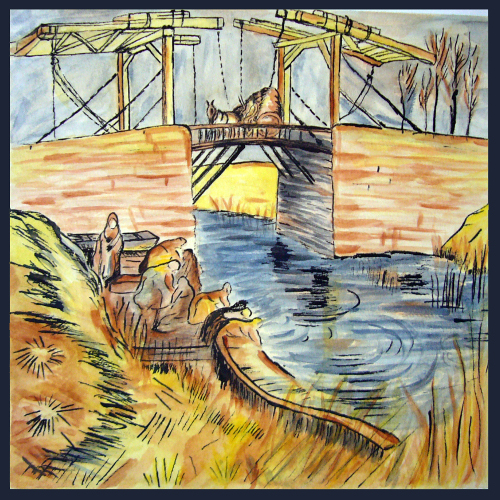
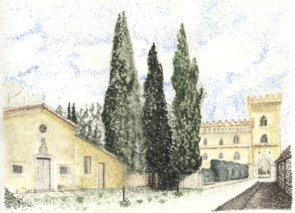
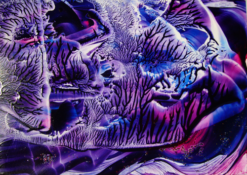

# Hello world

Hier ist K.

## K'irchturm
'20 Anna-Dengel-S.

## K'arlo
'15 SchiessstandG.

## K'Spatz
'15 SchiessstandG.

## K'Giraffe
'12 BaumhaselR.

## K'arlo
'11 HelmholtzS.

## K'Brücke
'10 HelmholtzS.

## K'Achensee
'09 HelmholtzS.

## K'opie I Cézanne
'08 Ernst-Reuter-Pl.

## K'opie II
'08 Ernst-Reuter-Pl.

## K'opie III
'08 Ernst-Reuter-Pl.

## K'opie v.Gogh
'08 Ernst-Reuter-Pl.

## K'uh
'08 Ernst-Reuter-Pl.

## K'Stein
'08 HelmholtzS.

## K'apitell
'08 HelmholtzS.

## K'Winter
'07 BaumhaselR.

## K'punktiert
'07 BaumhaselR.

## K'Architektur 
'07 BaumhaselR.

## K'Architektur
'07 BaumhaselR.

## K'Landwasserviadukt
~'04 BaumhaselR.

## K'Übung
'07 Ernst-Reuter-Pl.

## K'Fantasie
'06 BaumhaselR.

## K'Vogelsonne
~'05 HegelAll.

## K'Pavillon
'05 HegelAll.

## K'Blumenkopie
~'96 SchillerPl.

## K'Brei
~'90 GrillparzerS.

